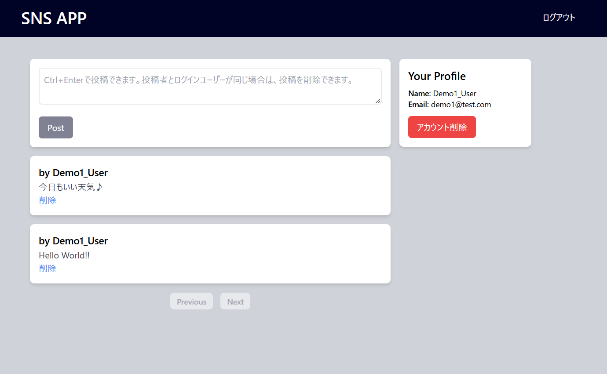
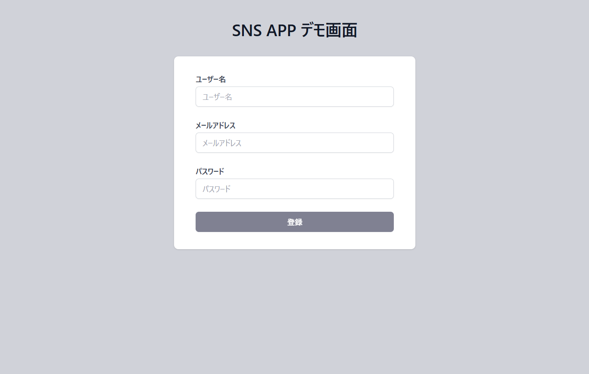
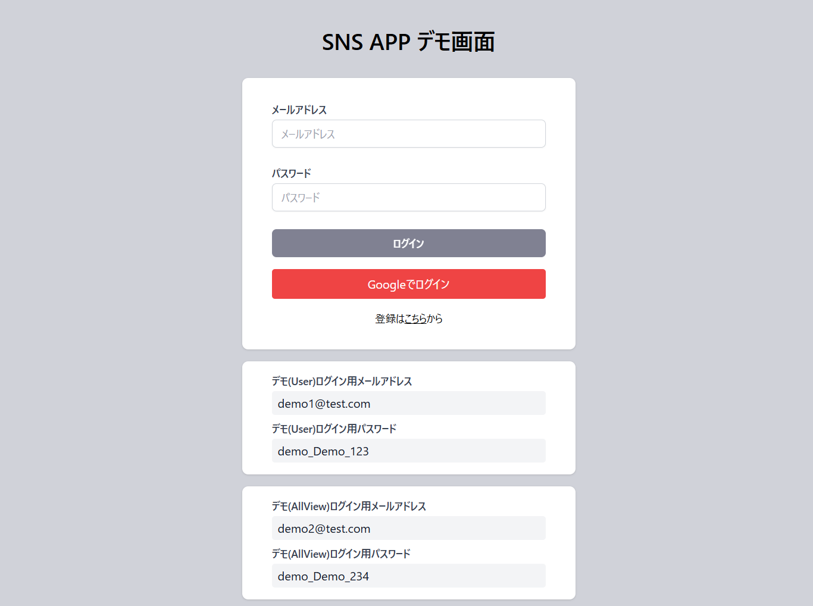
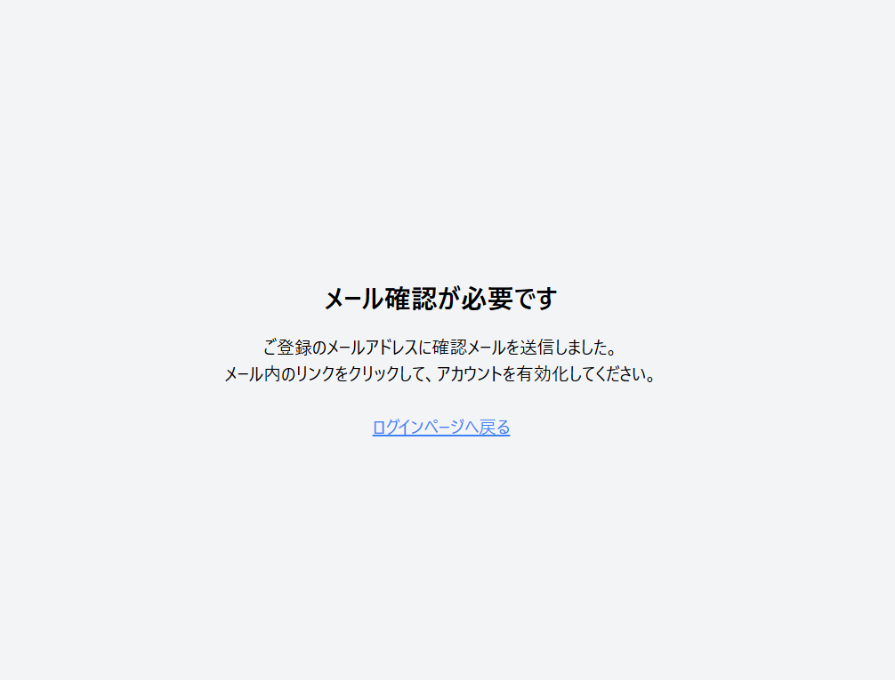
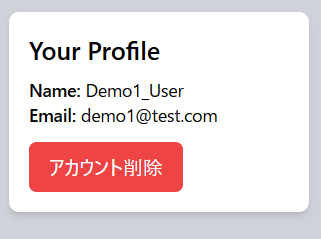
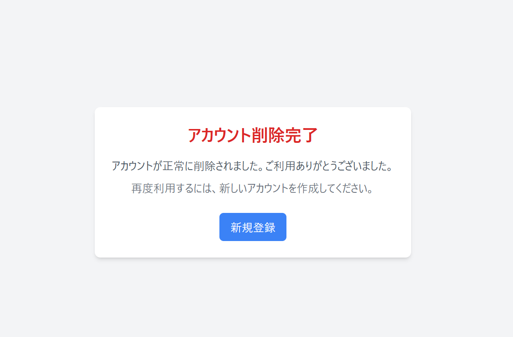

# SNS App - React × Supabase

## 概要

このアプリは、ユーザーが投稿を作成し、他のユーザーと共有できるシンプルな SNS プラットフォームです。  
ユーザーはメールまたは Google アカウントを使用してサインインし、投稿の作成・削除、ページネーションを利用して投稿を閲覧できます。

**デモサイト:** [portfolio-sns-app.vercel.app](https://portfolio-sns-app.vercel.app)

---

## スクリーンショット

  
  
  
  



---

## 技術構成

### フロントエンド

- React
- Tailwind CSS
- React Router
- Context API（グローバル状態管理）

### バックエンド

- Supabase（認証・データベース）

---

## セットアップ手順

### 1. リポジトリをクローン

```sh
git clone https://github.com/58yang/portfolio-sns-app.git
cd portfolio-sns-app
```

### 2. 依存関係をインストール

```sh
npm install
```

### 3. 環境変数の設定

プロジェクトのルートディレクトリに .env ファイルを作成し、以下を記述します。

```env
VITE_SUPABASE_URL=your_supabase_url
VITE_SUPABASE_ANON_KEY=your_supabase_anon_key
```

### 4. アプリを起動

```sh
npm start
```

---

## 機能一覧

- ユーザー認証（メール、Google）
- 投稿の作成・削除
- ページネーション機能
- ユーザープロフィールの表示
- ログアウト機能

---

## 技術的なポイント

- 認証の実装

  - Supabase Auth を活用し、Google 認証およびメール認証を実装しました。
  - セッションの永続化を実現するため、onAuthStateChange を活用し、認証状態の管理を行っています。
  - ログアウト機能の実装

- 状態管理

  - React の Context API を使用し、グローバルなユーザー情報を一元管理しています。
  - useContext を利用して必要なコンポーネントにデータを提供し、効率的な状態管理を実現しました。

- データベース

  - Supabase のデータベースを使用し、ユーザー情報と投稿を管理しています。
  - ユーザー情報はユーザー名、メールアドレス、プロフィール画像、自己紹介を管理しています。

- UI/UX の工夫

  - Tailwind CSS を使用し、レスポンシブデザインに対応しています。
  - ユーザーエクスペリエンス向上のため、エラーメッセージ表示やローディング処理を実装しました。
  - ユーザーのプロフィールを表示するためのサイドメニューを実装しました。
  - ユーザーのアカウントを削除するためのボタンを実装しました。

- 今後の追加予定
  - 投稿のリアルタイム更新機能
  - コメント機能の追加
  - いいね機能の追加
  - プロフィール画像の追加
